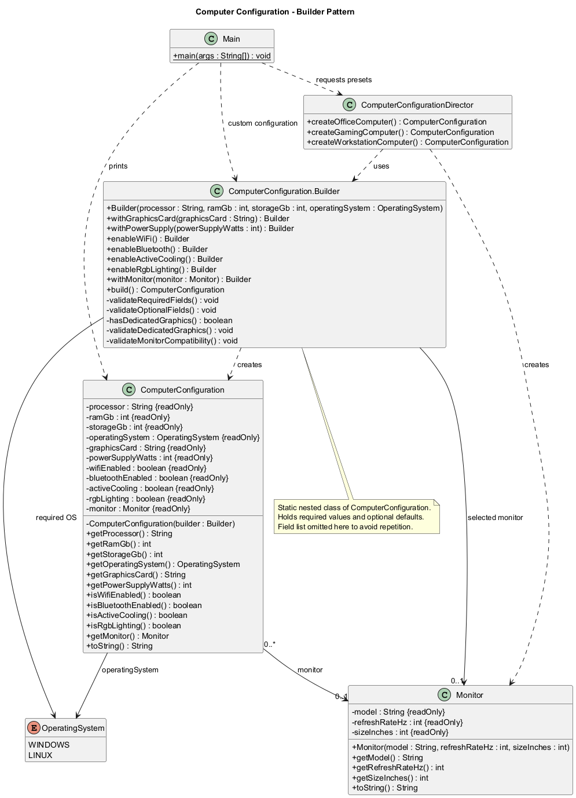

# Assignment 1 - Builder Pattern: Design Under Changing Requirements

Course: Software Design Patterns  
Language: Java 17+  
Submission: GitHub repository and report  
Assessment: Individual defense

GitHub repository: https://github.com/karima0072/assignment-1-builder

## 1. Problem and individual variant

The domain is Computer Configuration. A computer needs a processor, RAM, storage,
and an operating system. Other parts are optional. There are many possible
combinations, and some parts depend on other parts.

My individual constraint is: a dedicated graphics card needs a power supply of
at least 650W and active cooling. GAMING is the required preset. I also added
OFFICE and WORKSTATION.

The goal is to make construction readable and prevent invalid final objects.
These rules describe a simplified assignment model, not a full hardware
compatibility checker. In particular, the monitor rule below is a project rule,
not a claim about every real integrated GPU.

## 2. Initial constructor-based solution

The original approach is preserved in
`src/main/java/org/example/before/ConstructorComputerConfiguration.java`.
Its `example()` method contains this real call:

```java
return new ConstructorComputerConfiguration(
        "Intel Core i7", 32, 1000, OperatingSystem.WINDOWS,
        "RTX 4070", 750, true, true, true, false,
        new Monitor("Samsung", 144, 27));
```

This design has several concrete problems:

1. It is difficult to know what `32`, `1000`, and `750` mean without checking
   the parameter list. RAM and storage are both integers and can be swapped.
2. The four boolean arguments do not explain which features they enable.
   Changing their order can compile but produce the wrong configuration.
3. Callers must supply every optional value, even when they want ordinary defaults.
4. Adding another optional property changes the constructor signature and its calls.
5. Input checks, dependency checks, and field copying are all inside one
   constructor. It becomes harder to find a particular business rule.

The historical class remains immutable and checks its arguments. It is evidence
of the earlier design, not the final API used by Main.

## 3. Builder solution and participants

`ComputerConfiguration` has a private constructor. A caller first creates its
static nested `Builder` with four required values. The caller then chooses
optional values using named methods. Finally, `build()` checks the complete
selection and returns a new Product.

This is the manual example from Main:

```java
ComputerConfiguration custom = new ComputerConfiguration.Builder(
        "AMD Ryzen 5", 16, 512, OperatingSystem.LINUX)
        .enableWiFi()
        .enableBluetooth()
        .withMonitor(new Monitor("Dell", 75, 24))
        .build();
```

Every fluent option method returns `this`, so the next method runs on the same
Builder. `build()` returns a ComputerConfiguration instead. A separate Builder
interface is unnecessary because there is only one Product type.

### Builder-role traceability

| Role | Actual class or method | Responsibility |
| --- | --- | --- |
| Client | Main.main | Builds one custom computer and requests all three presets |
| Product | ComputerConfiguration | Stores the final immutable selection |
| Builder | ComputerConfiguration.Builder | Stores temporary choices and optional defaults |
| Build operation | Builder.build | Validates choices and creates a fresh Product |
| Director | ComputerConfigurationDirector | Stores three reusable construction recipes |
| Value object | Monitor | Stores immutable model, refresh rate, and size |
| Enum | OperatingSystem | Limits OS choices to WINDOWS or LINUX |

## 4. Properties and defaults

The Product has 11 properties. It uses String, int, boolean, an enum, and a
separate value object.

| Property | Type | Required? | Optional default |
| --- | --- | --- | --- |
| processor | String | Yes | None |
| ramGb | int | Yes | None |
| storageGb | int | Yes | None |
| operatingSystem | OperatingSystem | Yes | None |
| graphicsCard | String | No | null: integrated graphics |
| powerSupplyWatts | int | No | 500 |
| wifiEnabled | boolean | No | false |
| bluetoothEnabled | boolean | No | false |
| activeCooling | boolean | No | false |
| rgbLighting | boolean | No | false |
| monitor | Monitor | No | null: no monitor selected |

The defaults are stored in Builder fields. Java supplies null and false; the
500W default has an explicit initializer. These defaults allow a simple computer
without extra option calls. Active cooling is an optional feature in this model.
It does not mean that a real computer never needs cooling.

Monitor has three private final fields: String model, int refreshRateHz, and
int sizeInches. Neither Monitor nor ComputerConfiguration has setters.

## 5. Validation and individual constraint

Invalid input throws `IllegalArgumentException` with a descriptive message.
Builder options may temporarily be incomplete. No invalid final Product is
returned: all Product checks run before its private constructor is called.

| Method | Rules |
| --- | --- |
| Builder.validateRequiredFields | Processor is not null or blank; RAM > 0; storage > 0; OS is not null |
| Builder.validateOptionalFields | PSU >= 300W; a non-null graphics card name is not blank |
| Builder.validateDedicatedGraphics | Dedicated GPU requires PSU >= 650W and activeCooling = true |
| Builder.validateMonitorCompatibility | A monitor above 120 Hz requires a dedicated GPU |
| Monitor constructor | Model is not null or blank; refresh rate > 0; size > 0 |

A null graphics card means integrated graphics. Every non-null, nonblank string
means a dedicated card model, even the literal string "Integrated". To select
integrated graphics, leave the default or call `withGraphicsCard(null)`.
`withMonitor(null)` removes a selected monitor.

The GPU power rule and cooling rule are cross-field rules because each depends on
more than one value. For example, a dedicated GPU at 649W fails even with cooling.
At 650W it succeeds only when active cooling is enabled.

The extra cross-field rule reserves monitors above 120 Hz for configurations
with dedicated graphics. An integrated configuration accepts 120 Hz but rejects
121 Hz. With a dedicated GPU, the power and cooling checks still apply.

The RAM and storage minimum of 1 is a simple positive-number rule for the
assignment, not a recommendation for a modern computer.

## 6. Reusable presets

The Director creates a fresh Builder on every call. Recipes appear once in the
Director, and Main calls the methods instead of repeating them.

| Preset | CPU / RAM / storage | OS | Graphics / PSU | Features and monitor |
| --- | --- | --- | --- | --- |
| OFFICE | Intel Core i3 / 8 GB / 256 GB | WINDOWS | Integrated / 500W | Wi-Fi; Dell Office, 60 Hz, 24 inches |
| GAMING | Intel Core i7 / 32 GB / 1000 GB | WINDOWS | RTX 4070 / 750W | Wi-Fi, Bluetooth, active cooling, RGB; Samsung Gaming, 144 Hz, 27 inches |
| WORKSTATION | AMD Ryzen 9 / 64 GB / 2000 GB | LINUX | RTX A4000 / 850W | Active cooling; Dell Professional, 60 Hz, 32 inches |

All unlisted boolean features are false. Main builds the custom configuration
and all three presets. Only GAMING is printed, as required.

## 7. UML diagram



Editable source: [docs/builder-uml.puml](docs/builder-uml.puml).
The diagram shows the final implementation. The historical constructor class
is intentionally outside the final pattern diagram.

Main depends on Builder and Director. Director uses Builder to make Products.
Builder is a static nested class and creates ComputerConfiguration. The Product
references zero or one Monitor and one OperatingSystem value. The Monitor
relationship is an association, not exclusive ownership: immutable monitors may
be safely shared by several Products. Repeated Builder fields are omitted from
the diagram for readability; its methods match the source.

## 8. Three real Clean Code BEFORE -> AFTER examples

### Example 1: unclear flags become named actions

Before, from `ConstructorComputerConfiguration.example()`:

```java
"RTX 4070", 750, true, true, true, false,
```

After, from `createGamingComputer()`:

```java
.withGraphicsCard("RTX 4070")
.withPowerSupply(750)
.enableWiFi()
.enableBluetooth()
.enableActiveCooling()
.enableRgbLighting()
```

**What was wrong?** The boolean positions hide their meaning.
**Principles:** descriptive names and avoiding flag arguments.
**Why better?** Each choice is visible at the call site. The GAMING recipe also
deliberately enables RGB, while the old example left it off.

### Example 2: constructor validation becomes small named checks

Before, the historical constructor places all checks directly before field
assignments. For example:

```java
if (ramGb <= 0 || storageGb <= 0) {
    throw new IllegalArgumentException("RAM and storage must be greater than 0");
}
if (operatingSystem == null || powerSupplyWatts < 300) {
    throw new IllegalArgumentException("Operating system is required and PSU must be at least 300W");
}
```

After, the real `Builder.build()` reads:

```java
validateRequiredFields();
validateOptionalFields();
validateDedicatedGraphics();
validateMonitorCompatibility();
return new ComputerConfiguration(this);
```

**What was wrong?** The constructor mixes copying, basic checks, and component
dependencies. Some errors combine unrelated causes.
**Principles:** small functions, one responsibility, one level of abstraction,
and clear error handling.
**Why better?** Build reads as a short sequence. Each helper names a group of
rules, and the final basic checks give separate RAM, storage, OS, and PSU errors.

### Example 3: required inputs separated from optional defaults

Before, the historical constructor requires eleven arguments, including all
four booleans and a Monitor, for every call.

After, from `ComputerConfigurationTest.minimalBuilder()`:

```java
return new ComputerConfiguration.Builder("Intel Core i3", 8, 256, OperatingSystem.WINDOWS);
```

**What was wrong?** A caller had to know and supply optional values just to make
a basic configuration.
**Principles:** minimize function arguments and avoid repeated default choices.
**Why better?** The constructor needs only four required values. Builder owns
defaults; a caller adds only the options it needs. The four required arguments
are still positional, so this design does not remove every possible argument swap.

### Clean Code principles used

| Principle | Evidence |
| --- | --- |
| Small functions | Short option methods and validation helpers |
| One responsibility | Monitor stores monitor data; Director stores recipes |
| Descriptive naming | withPowerSupply and validateDedicatedGraphics |
| One level of abstraction | build delegates checks, then constructs the Product |
| Avoid flag arguments | enableWiFi and enableBluetooth take no boolean |
| Minimize arguments | Four required Builder arguments instead of eleven total |
| DRY | Preset recipes live in Director; GPU detection uses hasDedicatedGraphics |
| Clear error handling | IllegalArgumentException explains the broken rule |
| No hidden Product changes | Builder changes cannot mutate a previous Product |

Fluent methods intentionally both change Builder state and return that Builder.
They are a readable convention, not strict Command-Query Separation. Getters
only read values.

## 9. Design decision and rejected alternative

**Decision:** ComputerConfiguration is immutable after build().

**Alternative:** Allow public setters after construction.

**Reasoning:** Setters could turn a valid computer into an invalid one, such as
reducing its PSU after adding a dedicated GPU. They could also create unexpected
state changes for code that shares the Product. Private final fields and no
setters make each built computer easier to understand.

The Product copies all values from Builder. Strings and enum values are
immutable, primitive values are copied, and Monitor is also immutable, so
sharing its reference is safe. Reusing a Builder creates a different Product
without changing the first one.

Validation runs during build because component choices may be entered in any
order. For example, a caller can select a GPU first and add cooling later.
Validating every option immediately would reject useful intermediate states.
Monitor checks its own independent values in its constructor.

## 10. Automated testing

JUnit 5 tests assert actual values, exception messages, boundaries, and object
independence. The verified run used Temurin JDK 17.0.17 and Maven.
Result: **25 tests, 0 failures, 0 errors, 0 skipped**.

| Test method | What it verifies |
| --- | --- |
| minimalComputerUsesDefaults | Required values and all seven optional defaults |
| gamingPresetHasGamingComponents | GAMING GPU, RAM, PSU, flags, and monitor |
| workstationPresetHasLargeMemoryAndLinux | WORKSTATION capacity, OS, GPU, and flags |
| officePresetUsesIntegratedGraphics | OFFICE integrated graphics, RAM, Wi-Fi, monitor |
| rejectsBlankProcessor | Blank processor fails with a useful message |
| rejectsNullProcessor | Null processor fails |
| rejectsZeroRam | Zero RAM fails |
| rejectsZeroStorage | Zero storage fails |
| rejectsMissingOperatingSystem | Null OS fails |
| rejectsBlankGraphicsCard | Blank dedicated model fails |
| acceptsMinimumPowerSupply | 300W succeeds without dedicated graphics |
| rejectsPowerSupplyBelowMinimum | 299W fails |
| acceptsMinimumRamAndStorage | RAM = 1 and storage = 1 succeed |
| dedicatedGpuRejects649WattsEvenWithCooling | GPU power dependency at its lower boundary |
| dedicatedGpuRejectsMissingCoolingEvenWithEnoughPower | GPU cooling dependency independently of power |
| dedicatedGpuAccepts650WattsWithCooling | Both GPU requirements satisfied at exactly 650W |
| integratedGraphicsAccepts120HzMonitor | Monitor rule accepts its boundary |
| integratedGraphicsRejects121HzMonitor | Monitor rule rejects the next value |
| builderReuseDoesNotChangeFirstProduct | First Product keeps old fields and Monitor after Builder changes |
| fluentMethodsReturnSameBuilder | Every optional fluent method supports chaining |
| failedBuildCanBeCorrected | Builder remains usable after a validation failure |
| storesMonitorValues | Monitor getters return constructor values |
| rejectsNullOrBlankModel | Invalid Monitor model fails |
| rejectsNonPositiveRefreshRate | Zero and negative monitor refresh rate fail |
| rejectsNonPositiveSize | Zero and negative monitor size fail |

This covers at least three valid tests, three invalid tests, two boundary tests,
the individual GPU constraint, and Builder reuse.

## 11. Sample program output

The following single line was captured from the compiled application:

```text
ComputerConfiguration{processor='Intel Core i7', ramGb=32, storageGb=1000, operatingSystem=WINDOWS, graphicsCard=RTX 4070, powerSupplyWatts=750, wifiEnabled=true, bluetoothEnabled=true, activeCooling=true, rgbLighting=true, monitor=Samsung Gaming (144 Hz, 27 inches)}
```

Run with `mvn -q compile`, then `java -cp target/classes org.example.Main`.
Run tests with `mvn test`. README includes exact paths for this Windows setup.

## 12. Git development history

The repository initially had no commits, no Java source, a basic pom.xml, and
some staged IDE files. Development was recorded as separate real stages:

1. Create the OperatingSystem and immutable Monitor domain types.
2. Add the preserved constructor-based configuration.
3. Introduce the immutable Product and fluent Builder.
4. Add build-time validation in small named methods.
5. Add reusable presets, Main, and Maven build configuration.
6. Add the 25 automated tests.
7. Add UML, report, README, and defense notes.

The Builder stage is a historical intermediate stage before validation was
added. The final version validates all Products. No earlier commits were
rewritten. Pre-existing IDE files were excluded from assignment commits.
Use `git log --oneline --reverse` to inspect the actual history.

There was no GitHub remote, so no push was made. Create an empty GitHub repository,
connect it using the README commands, push the commits, and replace the URL
placeholder at the start of this report.
